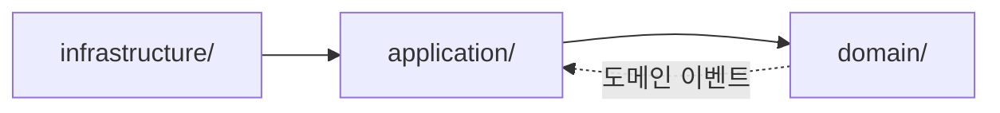
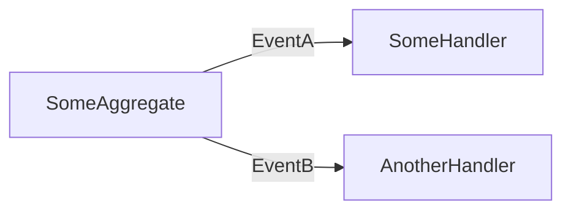

# Design Review: {topic}

**날짜**: YYYY-MM-DD
**ADR**: [{adr-filename}]({relative-path-to-adr})
**상태**: Reviewed
**패널**: api-shape-reviewer, integration-reviewer, test-surface-reviewer[, event-schema-reviewer, persistence-reviewer]

---

## 1. 테이블 변경

> DB 테이블 추가/제거/수정이 없으면 아래 표를 삭제하고 "해당 없음 (in-memory 구현 유지)" 한 줄로 대체한다.

| 작업 | 테이블 | 컬럼 / 제약 | 인덱스 | 이유 |
|------|--------|------------|--------|------|
| ADD  | `example_table` | `id UUID PK`, `created_at TIMESTAMP NOT NULL` | `(created_at)` | ... |
| MOD  | `existing_table` | + `status VARCHAR(20) NOT NULL DEFAULT 'pending'` | — | ... |
| DROP | `legacy_table`   | — | — | ... |

마이그레이션 순서·백필 전략이 중요한 경우 표 아래에 3~5줄로 서술한다.

---

## 2. 애그리게이트 / VO / 바운디드 컨텍스트

| 유형 | 이름 | 상태 | 불변식 / 핵심 속성 | 소속 컨텍스트 |
|------|------|------|-------------------|--------------|
| Aggregate Root | `ExampleAggregate` | NEW / MODIFIED / RENAMED | 불변식 1, 불변식 2 | {컨텍스트 이름} |
| Entity | `ExampleEntity` | NEW | ... | {컨텍스트 이름} |
| Value Object | `ExampleVO` | NEW | frozen, amount >= 0 | {컨텍스트 이름} |

**바운디드 컨텍스트 경계**

- 이 변경이 속한 컨텍스트: `{context-name}`
- 연관 컨텍스트와의 통합 방식: (Shared Kernel / Customer-Supplier / Conformist / ACL / Open Host / Published Language 중 택일 후 1~2줄 설명)
- 다른 컨텍스트 애그리게이트를 직접 참조하지 않는지 확인

---

## 3. 인터페이스 스키마 (Interface-Driven)

> 구현보다 인터페이스를 먼저 확정한다. 각 인터페이스에 대해 시그니처·예외 타입·반환 타입을 명시한다.

### 3.1 `{InterfaceName}` — {용도 한 줄}

```python
class {InterfaceName}(ABC):
    @abstractmethod
    def method_a(self, arg: ArgType) -> ReturnType:
        """{한 줄 설명}

        Raises:
            SpecificError: {발생 조건}
        """
        ...
```

- **목적**:
- **구현체 위치 (예정)**: `path/to/concrete.py`
- **호출자 (예정)**: `application/use_cases/...`
- **테스트 가능성**: fake 구현이 필요한가? 기존 in-memory 패턴으로 충분한가?

### 3.2 `{NextInterfaceName}`

(반복 — 필요한 만큼. 최소 1개, 최대 5개 권장.)

---

## 4. 모듈 경계 / 의존성 방향



> 실선: 직접 import · 점선: 이벤트/DI 역류. 위 블록을 해당 주제의 실제 모듈 구조로 교체한다.

| 신규/변경 모듈 | 경로 | 의존 가능 대상 | 금지 방향 |
|---------------|------|---------------|----------|
| `{module-a}` | `kiosk/domain/.../...` | domain 내부만 | application·infrastructure |
| `{module-b}` | `kiosk/application/.../...` | domain | infrastructure |

**경계 위반 감지 포인트**: (기존 코드에서 이 원칙이 깨질 수 있는 지점 1~2개 — 예: "CLI가 repository 직접 생성하면 위반")

---

## 5. 이벤트 스키마

> 이벤트가 없는 주제면 "해당 없음" 한 줄로 대체한다.



| 이벤트 | 페이로드 필드 | 발행자 | 수신자 | 불변/호환성 메모 |
|--------|--------------|-------|-------|----------------|
| `EventA` | `id: UUID`, `occurred_at: datetime`, ... | `Aggregate.method()` | `Handler1`, `Handler2` | 필드 제거 금지 · 추가만 허용 |

---

## 패널 요약

| 리뷰어 | 최종 의견 | 핵심 지적 |
|--------|---------|----------|
| api-shape-reviewer | 승인 / 수정 필요 | 한 줄 |
| integration-reviewer | 승인 / 수정 필요 | 한 줄 |
| test-surface-reviewer | 승인 / 수정 필요 | 한 줄 |
| (event-schema-reviewer) | ... | ... |
| (persistence-reviewer) | ... | ... |

## 미결 이슈

- (있으면 나열; 없으면 "없음" 한 줄)
