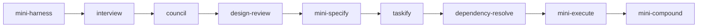
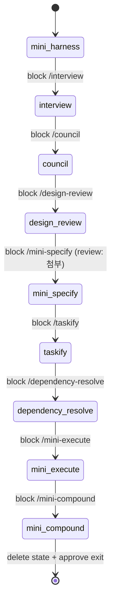

# mini-harness — Hook-Based Orchestrator

## Purpose

`/mini-harness [goal]` 한 번으로 전체 피드백 루프를 자동 실행한다.
실제 오케스트레이션은 Stop 훅(`scripts/mini-stop.sh`)이 담당한다.
상태는 `.dev/harness/runs/run-{run_id}/state/state.json` 에서 관리된다. 세션 포인터는 `.dev/harness/runs/run-{run_id}/sessions/{session_id}` (빈 마커 파일).

## 오케스트레이션 체인 순서

1. **interview** — 소크라테스 문답(6개 질문)으로 goal 구체화, `.dev/harness/runs/run-{run_id}/interview/interview.json` 저장
2. **council** — interview.json + goal로 ADR 생성 (product-owner 패널 포함), `.dev/harness/runs/run-{run_id}/adr/` 저장
3. **design-review** — ADR 기반 계약면(테이블·애그리게이트·인터페이스·모듈 경계·이벤트)을 고정 3명(+선택 2명) 패널이 단일 라운드로 리뷰, AskUserQuestion 승인 후 `.dev/harness/runs/run-{run_id}/review/` 저장
4. **mini-specify** — goal + ADR + design-review로 요구사항 생성, `.dev/harness/runs/run-{run_id}/requirement/requirements.json` 저장
5. **taskify** — requirements.json 읽기, 태스크 분해, `.dev/harness/runs/run-{run_id}/spec/spec.json` 저장
6. **dependency-resolve** — spec.json의 task 간 의존성 분석, dependencies[] 및 priority 필드 추가
7. **mini-execute** — spec.json 읽기, 의존성 순서에 따라 모든 태스크 실행
8. **mini-compound** — `.mini-harness/session/learnings.json` → `.mini-harness/learnings/*.md` 영구 파일 승격

## 동작 방식

- 이 스킬은 체인 시작점 역할만 함 (goal을 run state 파일에 저장)
- PreToolUse 훅: run_id 생성 → `runs/run-{run_id}/state/state.json` 생성, `runs/run-{run_id}/sessions/{session_id}` 기록
- Stop 훅: `runs/*/sessions/{session_id}` 스캔으로 run state 조회 → 다음 스킬 결정, block message에 `run_id:xxx` 포함
- PostToolUse 훅: mini-harness 완료 후 status 확인

## 상태 전이

`runs/run-{run_id}/state/state.json`: `{ run_id, skill_name, status: processing|end, goal, paths, timestamp }`

## 하네스 파일 경로 전체 목록

| 파일 | 생성 주체 | 삭제 주체 | 용도 |
|---|---|---|---|
| `.dev/harness/runs/run-{run_id}/state/state.json` | `mini-pre-tool-use.sh` | `mini-stop.sh` (mini-compound 완료 후) | run 오케스트레이션 상태 |
| `.dev/harness/runs/run-{run_id}/sessions/{session_id}` | `mini-pre-tool-use.sh` | `mini-stop.sh` (mini-compound 완료 후) | 세션 마커 (빈 파일, run_id는 경로에서 추론) |
| `.dev/harness/session-recovery.log` | `mini-start-session.sh` | 수동 삭제 (자동 삭제 없음) | compact 후 복구 진단 로그 |
| `.dev/harness/runs/run-{run_id}/interview/interview.json` | `interview` 스킬 | 유지 | 소크라테스 문답 결과 |
| `.dev/harness/runs/run-{run_id}/requirement/requirements.json` | `mini-specify` 스킬 | 유지 | 요구사항 목록 |
| `.dev/harness/runs/run-{run_id}/spec/spec.json` | `taskify` 스킬 | 유지 | 태스크 명세 |
| `.dev/harness/runs/run-{run_id}/adr/YYYY-MM-DD-{slug}.md` | `council` 스킬 | 유지 | 아키텍처 결정 기록 |
| `.dev/harness/runs/run-{run_id}/review/YYYY-MM-DD-{slug}.md` | `design-review` 스킬 | 유지 | 계약면 리뷰 결과 (테이블/애그리게이트/인터페이스/모듈/이벤트) |
| `.mini-harness/session/learnings.json` | `mini-execute` 스킬 | `mini-compound` 스킬 | 세션 내 마찰 임시 기록 |
| `.mini-harness/learnings/*.md` | `mini-compound` 스킬 | 유지 (영구 학습 라이브러리) | 검색 가능한 영구 rule |

## Rules

- PreToolUse 훅이 Skill 호출 전 run state 파일을 갱신한다.
- Stop 훅이 `runs/*/sessions/{session_id}` 스캔으로 run state를 찾아 다음 스킬을 결정한다.
- 모든 스킬이 정상 완료되면 run state 파일과 세션 마커가 자동 삭제되어 세션 종료 가능.
- run state 파일 존재 시에만 orchestration 모드; 없으면 기존 compound guard 로직 작동.
- compact 후 session_id가 바뀌어도 `runs/*/sessions/` 스캔으로 단일 활성 run을 자동 복구한다.
- `session-recovery.log`는 자동 삭제되지 않는다 — compact 복구 이슈 디버깅용 진단 파일이므로 필요 시 수동 삭제한다.
